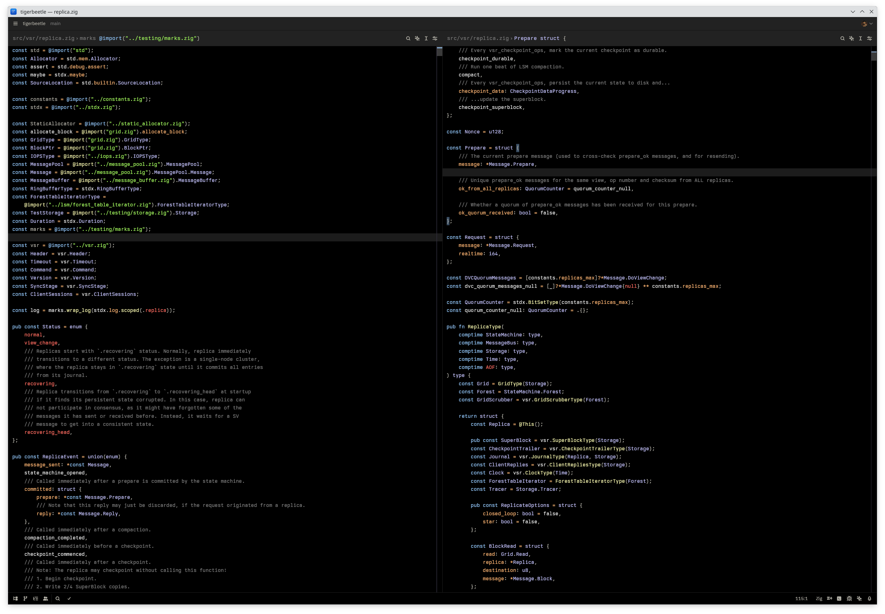

# IR Black Theme for Zed

A dark theme for [Zed](https://zed.dev) inspired by the classic IR_Black theme, featuring a pure black background with vibrant syntax highlighting colors.

## Installation

### Via Zed Extensions

1. Open Zed
2. Open the command palette (`Cmd+Shift+P` / `Ctrl+Shift+P`)
3. Search for "zed: extensions"
4. Search for "IR Black"
5. Click Install

## Contributing

Contributions are welcome! If you find any issues or have suggestions for improvements:

1. Fork the repository
2. Create a feature branch (`git checkout -b feature/amazing-feature`)
3. Make your changes
4. Commit your changes (`git commit -m 'Add some amazing feature'`)
5. Push to the branch (`git push origin feature/amazing-feature`)
6. Open a Pull Request

## License

This project is licensed under the MIT License - see the [LICENSE](LICENSE) file for details.

## Credits

- Original IR_Black theme by Todd Werth

**Enjoy coding with IR Black theme!** 🖤

If you like this theme, please consider giving it a ⭐ on GitHub. 